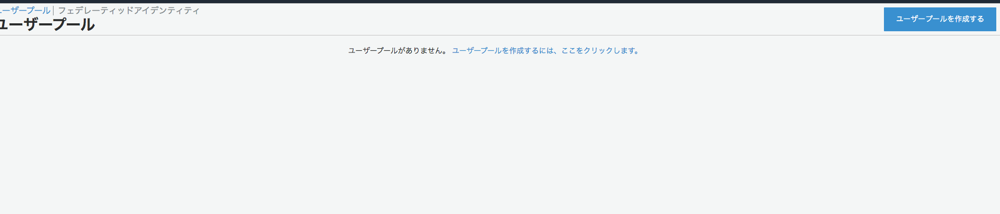
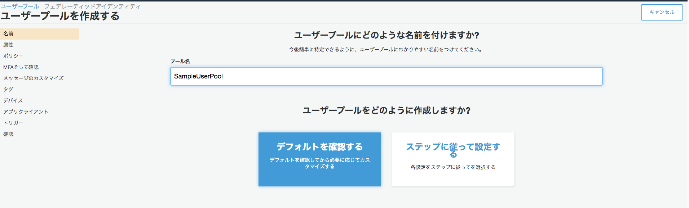
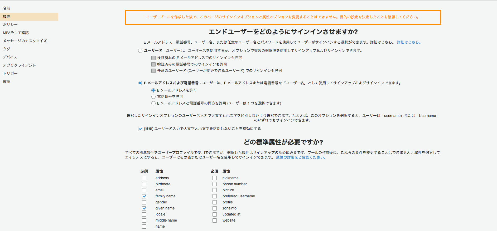
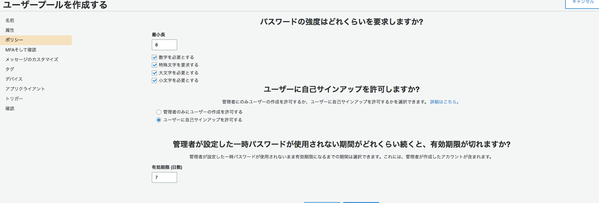
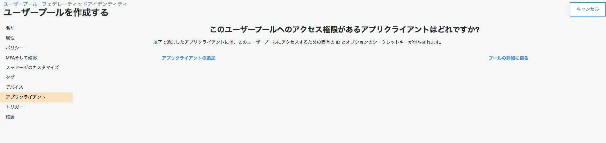
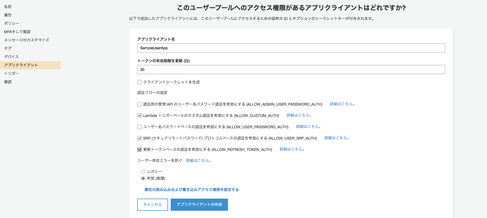
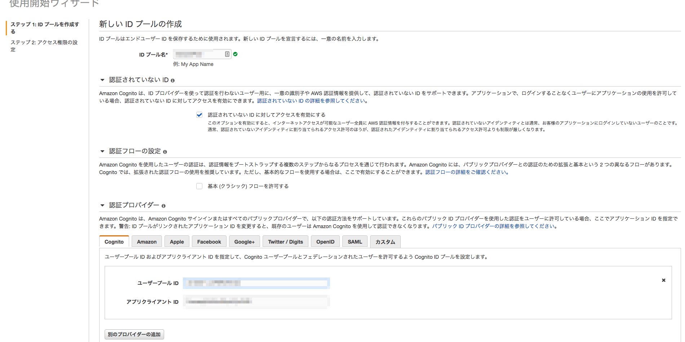
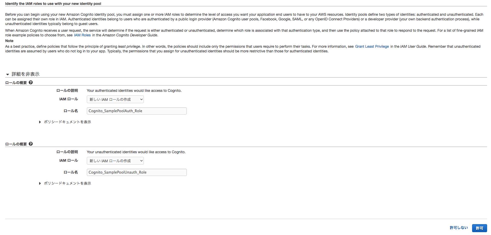
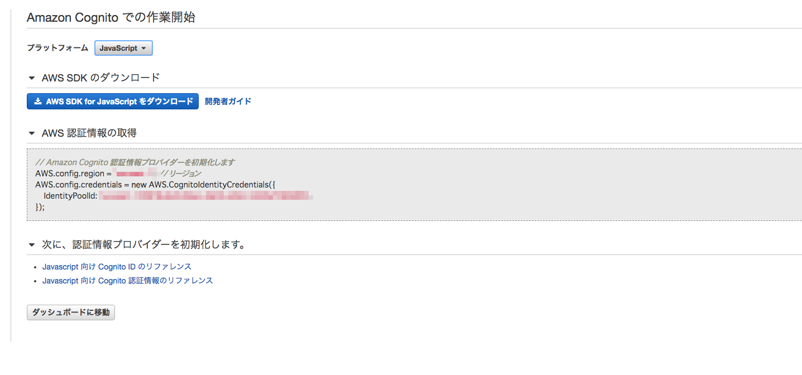

# congnito sample

## 動作確認日

2020-06-21

## congnito 設定

### 前提条件

* IAMの設定が完了していること。


### ユーザプールの作成

* 「ユーザプールの管理」を押下
* 「ユーザプールを作成」リンクを押下

 

プール名を設定し、デフォルトを確認するボタンを押下する。


 


* 属性の設定
    * メールアドレスおよび電話番号を設定
    * 標準属性にfamily name, given nameを設定

 

* ポリシーの確認
ポリシーはとりあえずそのままの設定

 


* アプリクライアントの設定

「アプリクライアントの追加」を押下

 

* アプリクライアント名を設定
* クライアントシークレットの生成のチェックを解除

アプリクライアントの生成ボタン押下

 

確認に移動し、プールの作成ボタンを押下

 

### クライアントプールの作成

「フェデレーティッドアイデンティティ」を押下


* IDプール名
* ユーザプールID
* アプリクライアントID
を設定



追加されるIAMの設定内容が表示され、許可をする。



プラットフォームをJavascriptに設定し、AWS証明情報の取得のサンプルコードを確認



## サンプルコード

### サインアップ

```
global.fetch = require('node-fetch')
const AmazonCognitoIdentity = require('amazon-cognito-identity-js')
const poolData = {
    UserPoolId: "*******",
    ClientId: "*******",
}
const userPool = new AmazonCognitoIdentity.CognitoUserPool(poolData);

const name = "*******";
const email = "******";
const password = "*******";
const attributeList = [];

attributeList.push(new AmazonCognitoIdentity.CognitoUserAttribute({
Name: 'email',
Value:"**************" 
}))

userPool.signUp(name, password, attributeList, null, (err, result) => {
if (err) console.log(err) 
console.log(result)
})
```


### Activate

```
global.fetch = require('node-fetch')
const AmazonCognitoIdentity = require('amazon-cognito-identity-js')
const poolData = {
        UserPoolId: "*******",
        ClientId: "*******",
}
const userPool = new AmazonCognitoIdentity.CognitoUserPool(poolData);

const name = "*******";
const activateKey = "*****";
const userData = {
        Username: "*******",
        Pool: userPool
}


const cognitoUser = new AmazonCognitoIdentity.CognitoUser(userData);
cognitoUser.confirmRegistration(activateKey, true, (err, result) => {
        if (err) console.log(err);
        console.log( result)
})
```


### Signin 

```
global.fetch = require('node-fetch')
const AmazonCognitoIdentity = require('amazon-cognito-identity-js')
const poolData = {
        UserPoolId: "*******",
        ClientId: "*******",
}
const userPool = new AmazonCognitoIdentity.CognitoUserPool(poolData);


const authenticationDetails = new AmazonCognitoIdentity.AuthenticationDetails({
        Username: "*******",
        Password: "*******"
})
const userData = {
        Username: "*******",
        Pool: userPool
}

const cognitoUser = new AmazonCognitoIdentity.CognitoUser(userData);

cognitoUser.authenticateUser(authenticationDetails, {
        onSuccess: result => {
                const accessToken = result.getAccessToken().getJwtToken()
                console.log(accessToken)
        },
        onFailure: err => {
                console.log(err);
        },
        mfaRequired: function (codeDeliveryDetails) {
                var verificationCode = prompt('Please input verification code', '');
                cognitoUser.sendMFACode(verificationCode, this);
        }
})
```

以上


